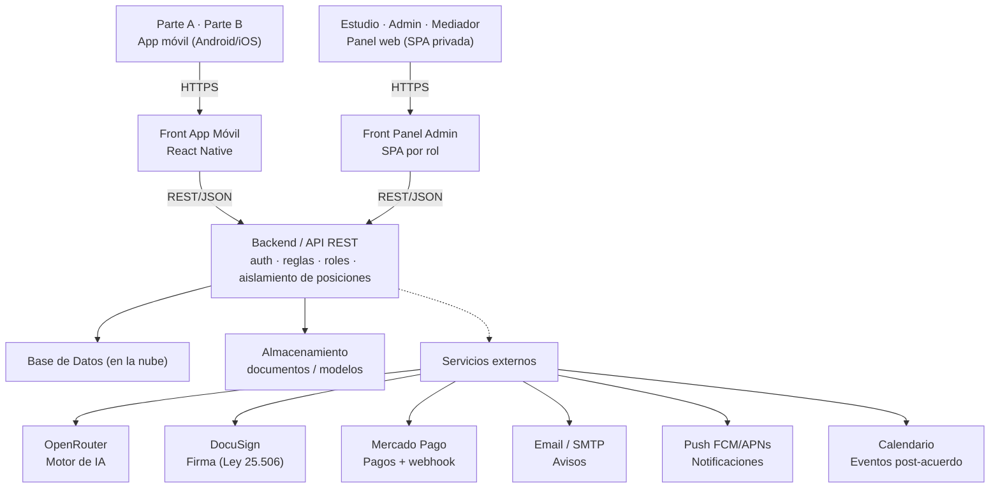
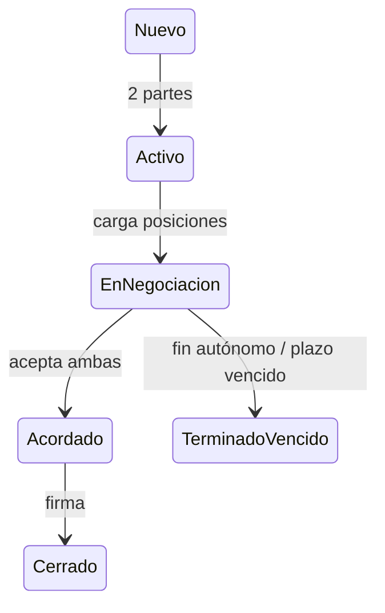

# Documentación Técnica — Proyecto Mediación

**App de Mediación Familiar con IA — Documento del Equipo**
**Proyecto:** Mediación · **Versión:** 1.0 · **Fecha:** 20 de julio de 2026
**Preparado por:** Magne Studios — Documento técnico interno, equipo de desarrollo.

> Este documento es la versión técnica interna para el equipo de desarrollo. No incluye la información comercial (cronograma de cuotas, esquema de pago del proyecto ni captación de inversores como negocio), que se maneja en el Documento de Requerimientos Funcionales (DRF) del cliente. Los ítems marcados como «a confirmar» requieren una definición del equipo o del cliente antes de implementarse. El núcleo operativo a resolver primero es el aislamiento de posiciones entre partes y el motor de IA que une posiciones y propone acuerdos por rondas.

## Índice

1. Introducción, Stack y Alcance Técnico
2. Arquitectura del Sistema
3. Roles y Permisos
4. Reglas de Negocio y Glosario
5. Modelo de Datos (ERD, Diccionario y Estados)
6. Contrato de API
7. Integraciones Externas
8. Flujos de Usuario
9. Backlog de Historias de Usuario
10. Requerimientos No Funcionales y Criterios de Aceptación
11. Entornos, Convenciones y Puesta en Marcha

---

## 1. Introducción, Stack y Alcance Técnico

Proyecto Mediación es una aplicación móvil (Android e iOS) de resolución de conflictos familiares que emplea inteligencia artificial para acercar a las partes mediante métodos autocompositivos: negociación, conciliación y mediación. La plataforma actúa como facilitador —no como juez ni parte—: cada parte carga sus posiciones de forma privada, con un rango de acuerdo (máximo y mínimo), y la IA une esas posiciones para proponer puntos de encuentro. Si la propuesta no prospera, la negociación itera por rondas y, a partir de la tercera, puede sumarse un mediador humano. Los acuerdos alcanzados se firman digitalmente con validez legal (Ley 25.506).

El sistema se compone de una app móvil para ambas partes, un panel web para estudios jurídicos, un backend / API REST que concentra la autenticación, las reglas de negocio, el aislamiento de la información entre partes y el control de acceso por rol, una base de datos en la nube y un motor de IA conmutable. Se integra con OpenRouter (IA), DocuSign (firma), Mercado Pago (cobros), correo electrónico y notificaciones push.

### Stack de referencia (a confirmar por el equipo)

| Capa | Propuesta |
|---|---|
| App móvil (ambas partes) | Framework multiplataforma React Native (un solo código para Android e iOS), con internacionalización (i18n) para español e inglés según el idioma del dispositivo. |
| Panel web estudios | SPA privada (por ejemplo, React) con autenticación por rol, para que los estudios gestionen sus casos por carpetas manteniendo la marca de la aplicación. |
| Backend / API | API REST en JSON (por ejemplo, Node.js) con autenticación por token (JWT) y control de acceso por rol y por pertenencia al caso. |
| Base de datos | Base relacional en la nube (por ejemplo, PostgreSQL / Supabase). Aísla las posiciones privadas de cada parte a nivel de consulta. |
| Motor de IA | Acceso vía OpenRouter: el modelo es conmutable por configuración, sin rehacer la lógica de unión de posiciones y generación de propuestas. |
| Firma digital | DocuSign para la firma de identidad (onboarding) y de acuerdos, con validez conforme a la Ley 25.506. |
| Pagos | Mercado Pago (Checkout Pro + webhooks) para los planes de suscripción de partes y estudios. |
| Notificaciones | Correo transaccional (SMTP) y push móvil (FCM para Android / APNs para iOS). |
| Almacenamiento | Bucket de objetos para documentos de acuerdo y modelos provistos por el cliente; en la base solo se guarda la URL. La biometría se valida en el onboarding y no se almacena cruda. |

El stack anterior es una recomendación para alinear al equipo; puede ajustarse a las tecnologías con las que ya trabajan el backend, la base de datos y el frontend. Lo importante es respetar la separación app / panel / API, la API como contrato único, el aislamiento de posiciones y el modelo de datos de la sección 5.

### Alcance técnico de la v1

- **Módulo 1 — Identidad y onboarding:** registro con documento (DNI), verificación biométrica, firma de identidad y consentimiento (DocuSign) y aceptación de Términos y Condiciones (RF-AUT).
- **Módulo 2 — Casos y vinculación:** creación de caso/sala, selección de método (negociación, conciliación o mediación) e invitación de la contraparte por link, código o correo (RF-CAS).
- **Módulo 3 — Negociación e IA:** carga privada de posiciones con rango de acuerdo, motor de IA que une posiciones y propone acuerdos, iteración por rondas y mediador humano desde la tercera ronda (RF-NEG, RF-IA, RF-MED).
- **Módulo 4 — Acuerdos y post-acuerdo:** trazabilidad e historial, firma digital, generación y exportación del documento, avisos de incumplimiento, tareas/accionables y eventos de calendario (RF-TRZ, RF-ACU, RF-POS).
- **Módulo 5 — Estudios jurídicos:** panel web de gestión, organización por carpetas y presencia permanente de la marca (RF-EST).
- **Módulo 6 — Monetización, plazos e inversores:** planes con límites y cobro por Mercado Pago, plazos/SLA con semáforo y notificaciones, y landing de captación de inversores (RF-SLA, RF-MON, RF-INV, RF-CFG).

Quedan como definiciones a cerrar durante el desarrollo, sin frenar el avance: el nombre, la marca y el logotipo definitivos; la paleta de colores final (línea pastel de relajación); y el detalle del esquema de monetización (planes y precios).

---

## 2. Arquitectura del Sistema

La aplicación sigue una arquitectura cliente–servidor con dos frontends independientes —la app móvil de las partes y el panel web de los estudios— que consumen una misma API REST. La API es el único punto que accede a la base de datos y a los servicios externos, lo que centraliza las reglas de negocio, la seguridad y, de forma crítica, el aislamiento de la información privada de cada parte.

*Diagrama de arquitectura general de Proyecto Mediación (reconstrucción textual del original).*

### Decisiones clave

- **Aislamiento de posiciones en el backend:** los ítems y rangos privados de una parte nunca se devuelven al frontend de la contraparte. La API filtra por caso y por parte en cada consulta; el aislamiento no depende del cliente.
- **IA conmutable vía OpenRouter:** la unión de posiciones y la generación de propuestas viven en el backend; el modelo se cambia por configuración sin rehacer la lógica (RF-IA-005).
- **API como contrato único:** app móvil y panel web acuerdan los endpoints de la sección 6 y pueden desarrollarse en paralelo.
- **Webhook de pago:** el estado real de un pago lo confirma Mercado Pago mediante webhook; el frontend nunca marca una suscripción como pagada por su cuenta.
- **Firma con validez legal delegada:** la firma de identidad y de acuerdos se realiza vía DocuSign; la validez depende de la firma y de la voluntad de las partes, no de la plataforma.
- **Escalabilidad:** el servidor y la base se dimensionan para crecer con el volumen de casos, partes y rondas de IA (ver RNF-06).

---

## 3. Roles y Permisos

El sistema define cuatro roles. El control de acceso se aplica en el backend: cada endpoint valida el rol y, cuando corresponde, la pertenencia del recurso al usuario y al caso (por ejemplo, que una parte solo acceda a sus propias posiciones y nunca a las de la contraparte).

| Acción / Permiso | Admin | Parte | Mediador | Estudio |
|---|---|---|---|---|
| Registrarse (alta pública) | — | Sí | — | — |
| Crear caso / sala y elegir método | Sí | Sí | — | Sí |
| Invitar a la contraparte (link / código / email) | Sí | Sí | — | Sí |
| Cargar posiciones privadas y rangos | — | Sí | — | — |
| Ver las posiciones privadas de la contraparte | — | — | **A confirmar** | — |
| Ver propuestas de la IA del caso | — | Sí | Sí | — |
| Responder (aceptar / rechazar) propuesta | — | Sí | — | — |
| Solicitar mediador humano (desde ronda 3) | — | Sí | — | — |
| Intervenir como mediador en el caso | — | — | Sí | — |
| Firmar el acuerdo | — | Sí | — | — |
| Generar / exportar documento del acuerdo | Sí | Sí | — | Sí |
| Registrar aviso de incumplimiento | — | Sí | — | — |
| Gestionar casos por carpetas (panel web) | Sí | — | — | Sí |
| Administrar planes, límites y cobros | Sí | — | — | Propio |
| Conmutar el modelo de IA (configuración) | Sí | — | — | — |
| Gestionar usuarios y ver métricas globales | Sí | — | — | — |

El rol **Parte** es el usuario final de la app; solo accede a sus propios casos y a sus propias posiciones. El rol **Mediador** se habilita en un caso únicamente desde la tercera ronda y previa solicitud. **Queda a confirmar** si el mediador humano accede a las posiciones privadas de ambas partes (bajo deber de confidencialidad) o solo a las propuestas agregadas de la IA. El **Admin** es super-usuario de la plataforma (Magne Studios); el **Estudio** opera sobre sus propios casos desde el panel web.

---

## 4. Reglas de Negocio y Glosario

Estas reglas deben implementarse en el backend de forma consistente. Los valores marcados «a confirmar» requieren una definición antes de codificarse.

| Código | Regla |
|---|---|
| RN-01 | **Aislamiento de posiciones.** Una parte nunca ve los ítems ni los rangos de la otra. La API no devuelve al frontend de una parte los datos privados de la contraparte bajo ninguna circunstancia. |
| RN-02 | **Rango de acuerdo.** Cada ítem admite un valor máximo y uno mínimo. Existe zona de acuerdo cuando los rangos de ambas partes se solapan; la parte además indica en qué ítems está dispuesta a ceder. |
| RN-03 | **Propuesta de la IA.** La IA une las posiciones de ambas partes y propone un punto de encuentro dentro del solapamiento (o el más cercano), sin exponer los datos privados de cada una. |
| RN-04 | **Iteración por rondas.** Ante el rechazo de una propuesta se habilita una nueva ronda. El sistema mantiene un contador de ronda por caso y registra cada rechazo con su marca temporal. |
| RN-05 | **Mediador humano desde la ronda 3.** Recién a partir de la tercera ronda las partes pueden solicitar un mediador humano. **Queda a confirmar** si basta la solicitud de una parte o se requiere el acuerdo de ambas. |
| RN-06 | **Fundamentación de la propuesta.** En casos con menores, la propuesta incluye fundamentación (interés superior del niño); en cuestiones económicas la fundamentación puede omitirse. |
| RN-07 | **Vinculación de partes.** Un caso requiere al menos dos partes y queda activo cuando ambas están asociadas. La contraparte se une por link, por código o por invitación de correo. |
| RN-08 | **Terminación autónoma.** Cualquiera de las partes puede declarar expresamente el fin de una negociación; la terminación queda registrada con su marca temporal. |
| RN-09 | **Firma y validez.** Los acuerdos se firman con DocuSign (Ley 25.506). La validez y el cumplimiento dependen de la firma y de la voluntad de las partes; la plataforma actúa como facilitador, no como juez ni parte. |
| RN-10 | **Plazos y semáforo (SLA).** Cada tipo de caso admite un plazo de respuesta configurable. Un indicador visual tipo semáforo (verde / amarillo / rojo) refleja el tiempo restante; una parte puede fijar un plazo puntual (ej. respuesta para el día siguiente). |
| RN-11 | **Notificaciones.** Los eventos relevantes (invitaciones, propuestas, vencimientos e información institucional) disparan aviso por correo y push. El detalle de eventos se define en la sección 7. |
| RN-12 | **Confidencialidad y datos sensibles.** Documento, biometría, firma y datos de menores se tratan con consentimiento. La información del caso solo es accesible por las partes; no se expone a terceros. La biometría se valida en el onboarding y no se almacena cruda (a confirmar con el proveedor). |
| RN-13 | **Continuidad de casos.** Se puede volver a un caso anterior entre las mismas partes para un nuevo conflicto relacionado, conservando el historial. |
| RN-14 | **Post-acuerdo.** Al aceptarse el acuerdo se generan tareas / accionables asociados; un accionable puede agregarse como evento de calendario del usuario (ej. buscar al hijo en el colegio). |
| RN-15 | **Monetización.** Existen planes (base, simple, plus) con límites por plan (carpetas, casos, iteraciones de IA). Los estudios cuentan con un plan propio. Los cobros se realizan por Mercado Pago. Precios y límites finales quedan a confirmar. |
| RN-16 | **IA conmutable.** El modelo de IA se cambia por configuración vía OpenRouter, sin rehacer la lógica de unión de posiciones ni de generación de propuestas. |

### Glosario

| Término | Definición |
|---|---|
| Parte / Contraparte | Cada uno de los usuarios involucrados en un conflicto. Cargan posiciones de forma privada; una no ve los datos de la otra. |
| Caso / Sala | Espacio de resolución de un conflicto, con nombre, descripción y un método asignado. Vincula al menos a dos partes. |
| Método | Vía autocompositiva del caso: negociación, conciliación o mediación. |
| Ítem / Posición | Requerimiento que una parte carga (por categoría o personalizado) con su rango de acuerdo y las condiciones en que puede ceder. |
| Rango de acuerdo | Valor máximo y mínimo de un ítem. El solapamiento entre partes define la zona donde la IA puede proponer. |
| Ronda | Iteración de negociación. Ante un rechazo se abre una nueva; desde la tercera se habilita el mediador humano. |
| Propuesta | Punto de encuentro que genera la IA a partir de las posiciones de ambas partes; puede incluir fundamentación. |
| Mediador humano | Tercero que puede sumarse desde la ronda 3 para facilitar el acuerdo cuando la negociación se traba. |
| Acuerdo | Resultado aceptado por las partes, firmado digitalmente (Ley 25.506) y exportable. |
| Estudio jurídico | Cliente institucional que gestiona sus casos por carpetas desde el panel web, manteniendo la marca de la app. |
| Inversor | Interesado captado por un formulario/landing público; registra capital disponible y experiencia. No es un rol con cuenta. |

---

## 5. Modelo de Datos

El siguiente diagrama entidad-relación muestra las tablas principales y sus relaciones. El detalle de campos está en el diccionario de datos que le sigue. Las relaciones son 1 → N salvo indicación.

### Tablas principales (según ERD)

| Tabla | Campos clave (PK/FK) mostrados en el ERD |
|---|---|
| `estudios` | PK `id`; `nombre`, `activo`; FK `plan_id`; `marca_config` |
| `carpetas` | PK `id`; FK `estudio_id`; `nombre` |
| `usuarios` | PK `id`; `rol`, `nombre`, `email`; `documento`, `telefono`; `idioma`, `activo`; FK `estudio_id`; `verif_biometrica` |
| `casos` | PK `id`; FK `creador_id`; FK `estudio_id`, `carpeta`; `metodo`, `estado`; `ronda_actual`, `sla`; `descripcion` |
| `caso_partes` | PK `id`; FK `caso_id`, `usuario_id`; `rol_en_caso`, `estado` |
| `items` | PK `id`; FK `caso_id`, `parte_id`; `categoria`, `nombre`; `valor_min`, `valor_max`; `puede_ceder`; `privado` (default true) |
| `propuestas` | PK `id`; FK `caso_id`, `ronda_id`; `contenido`, `fundament.`; `estado`, `modelo_ia`; `fecha` |
| `respuestas_propuesta` | PK `id`; FK `propuesta_id`; FK `parte_id`; `decision`, `fecha` |
| `mediaciones` | PK `id`; FK `caso_id`, `mediador_id`; `estado`, `ronda`; `fecha_solicitud` |
| `acuerdos` | PK `id`; FK `caso_id`; `documento_url`, `estado`; `docusign_envelope_id` |
| `tareas` | PK `id`; FK `acuerdo_id`, `caso_id`; `tipo`, `descripcion`; `fecha_evento`, `estado` |
| `planes` | PK `id`; `nombre`; `limite_casos`; `limite_iter_ia`; `precio` |
| `suscripciones` | PK `id`; FK `usuario/estudio`; FK `plan_id`; `estado`, `fechas` |
| `pagos` | PK `id`; FK `suscripcion_id`; `mp_payment_id`; `estado`, `monto` |
| `notificaciones` | PK `id`; FK `usuario_id`, `caso_id`; `canal`, `evento`; `estado`, `fecha` |
| `auditoria` | PK `id`; FK `usuario_id`; `accion`, `entidad`; `fecha` |

*Nota: el resto de las tablas se detallan en "Otras tablas" más abajo.*

### Diccionario de datos

#### `usuarios`

| Campo | Tipo | Descripción |
|---|---|---|
| id | PK / uuid | Identificador del usuario. |
| rol | enum | admin \| parte \| mediador \| estudio. |
| nombre, apellido | text | Datos personales. |
| email | text (unique) | Correo de acceso y notificaciones. |
| documento | text | DNI; requerido para completar el registro (RF-AUT-001). |
| telefono | text | Contacto y, opcionalmente, push. |
| verif_biometrica | enum / bool | Resultado de la validación biométrica del onboarding. No se guarda la biometría cruda. |
| idioma | text | Idioma preferido (es / en); por defecto, el del dispositivo. |
| password_hash | text | Hash de la contraseña. |
| estudio_id | FK estudios | Estudio al que pertenece (nullable; aplica a rol estudio). |
| activo | bool | Habilitación del usuario. |
| fecha_alta | timestamp | Fecha de creación. |

#### `casos`

| Campo | Tipo | Descripción |
|---|---|---|
| id | PK | Identificador del caso / sala. |
| creador_id | FK usuarios | Quién creó el caso. |
| estudio_id | FK estudios | Estudio dueño del caso (nullable). |
| carpeta_id | FK carpetas | Carpeta del panel de estudios (nullable). |
| nombre, descripcion | text | Datos del caso. |
| metodo | enum | negociacion \| conciliacion \| mediacion. |
| estado | enum | Ver máquina de estados. |
| ronda_actual | int | Número de ronda vigente (habilita mediador desde 3). |
| sla_tipo, plazo | text / timestamp | Tipo de plazo y vencimiento para el semáforo. |
| fecha_alta | timestamp | Fecha de creación. |

#### `items`

| Campo | Tipo | Descripción |
|---|---|---|
| id | PK | Identificador del ítem/posición. |
| caso_id | FK casos | Caso al que pertenece. |
| parte_id | FK usuarios | Parte dueña del ítem (privacidad / aislamiento). |
| categoria | enum | cuidado_ninos \| cronogramas \| bienes \| economico \| personalizado. |
| nombre, descripcion | text | Requerimiento de la parte. |
| valor_min, valor_max | decimal / text | Rango de acuerdo del ítem (RN-02). |
| puede_ceder | bool | Si la parte está dispuesta a ceder en el ítem. |
| condiciones_cesion | text | Condiciones en las que cedería (RF-NEG-003). |
| privado | bool | Verdadero por defecto: nunca visible a la contraparte. |

#### `propuestas`

| Campo | Tipo | Descripción |
|---|---|---|
| id | PK | Identificador de la propuesta. |
| caso_id, ronda_id | FK | Caso y ronda que la originan. |
| contenido | json | Punto de encuentro propuesto por la IA (sin datos crudos de cada parte). |
| fundamentacion | text | Fundamento (ej. interés superior del niño); nullable. |
| estado | enum | pendiente \| aceptada \| rechazada. |
| modelo_ia | text | Modelo de OpenRouter usado (conmutable). |
| fecha | timestamp | Fecha de generación. |

### Otras tablas

| Tabla | Campos principales |
|---|---|
| estudios | id (PK), nombre, plan_id (FK), marca_config, activo |
| carpetas | id (PK), estudio_id (FK), nombre |
| caso_partes | id (PK), caso_id (FK), usuario_id (FK), rol_en_caso (parte_a\|parte_b\|mediador), estado_invitacion, fecha_union |
| invitaciones | id (PK), caso_id (FK), tipo (link\|codigo\|email), token, email_destino, estado, fecha_envio |
| rondas | id (PK), caso_id (FK), numero, estado, fecha_inicio |
| respuestas_propuesta | id (PK), propuesta_id (FK), parte_id (FK), decision (acepta\|rechaza), fecha |
| mediaciones | id (PK), caso_id (FK), mediador_id (FK), estado, ronda, fecha_solicitud, fecha_aceptacion |
| acuerdos | id (PK), caso_id (FK), contenido, documento_url, docusign_envelope_id, estado, fecha |
| firmas | id (PK), acuerdo_id (FK), usuario_id (FK), docusign_status, fecha_firma |
| tareas | id (PK), acuerdo_id (FK), caso_id (FK), tipo (tarea\|evento_calendario), descripcion, fecha_evento, estado |
| incumplimientos | id (PK), acuerdo_id (FK), reportante_id (FK), descripcion, fecha |
| notificaciones | id (PK), usuario_id (FK), caso_id (FK), canal (email\|push), evento, estado, fecha |
| planes | id (PK), nombre (base\|simple\|plus\|estudio), limite_carpetas, limite_casos, limite_iteraciones_ia, precio |
| suscripciones | id (PK), usuario_id / estudio_id (FK), plan_id (FK), estado, fecha_inicio, fecha_fin |
| pagos | id (PK), suscripcion_id (FK), mp_payment_id, estado, monto, metodo, fecha, raw_webhook (json) |
| inversores | id (PK), nombre, email, capital_disponible, experiencia, fecha |
| auditoria | id (PK), usuario_id (FK), accion, entidad, entidad_id, detalle, fecha |

### Máquina de estados del caso

*Ciclo de vida de un caso. La negociación itera por rondas; desde la ronda 3 puede sumarse un mediador humano.*

| Entidad | Estados |
|---|---|
| Caso | nuevo → activo → en_negociacion → acordado → cerrado; ramas a terminado (fin autónomo) o vencido (plazo). |
| Ronda | ronda_1 → ronda_2 → ronda_3 (mediador disponible) → ronda_n. Cada rechazo abre una nueva. |
| Propuesta | pendiente → aceptada (ambas partes) \| rechazada (una parte → nueva ronda). |
| Acuerdo | borrador → enviado_a_firma → firmado → (con_aviso si se registra incumplimiento). |
| Pago | pendiente → aprobado \| rechazado (confirmado por webhook de Mercado Pago). |

---

## 6. Contrato de API

API REST sobre HTTPS, con cuerpos en JSON. Autenticación por token JWT en el header `Authorization: Bearer <token>`. Cada endpoint indica el rol requerido; el backend valida además la pertenencia del recurso (una parte solo opera sobre su caso y sus posiciones). Las respuestas usan códigos HTTP estándar y un formato de error uniforme.

Error estándar: `{ "error": { "code": "STRING", "message": "..." } }` · Listados paginados: `?page=&limit=` con `{ data:[], total, page, limit }`.

### Autenticación e identidad

| Método | Endpoint | Rol | Descripción |
|---|---|---|---|
| POST | /auth/register | Público | Alta de parte con datos personales y documento. |
| POST | /auth/login | Público | Login por email y contraseña; devuelve JWT. |
| POST | /auth/biometria | Autenticado | Registra el resultado de la validación biométrica del onboarding. |
| POST | /auth/consentimiento | Autenticado | Firma de identidad (DocuSign) y aceptación de T&C. |
| POST | /auth/recuperar | Público | Recuperación de acceso por canal seguro. |
| POST | /auth/refresh | Autenticado | Renueva el token. |
| GET | /me | Autenticado | Datos del usuario actual. |

### Casos y vinculación

| Método | Endpoint | Rol | Descripción |
|---|---|---|---|
| POST | /casos | Parte / Estudio | Crea un caso con nombre, descripción y método. |
| GET | /casos | Autenticado | Lista los casos propios del usuario. |
| GET | /casos/:id | Parte del caso | Detalle del caso (sin exponer posiciones de la contraparte). |
| POST | /casos/:id/invitaciones | Parte / Estudio | Genera invitación por link, código o correo. |
| POST | /casos/unirse | Parte | La contraparte se une por link o código. |
| PATCH | /casos/:id/plazo | Parte | Fija un plazo puntual de respuesta (SLA). |
| PATCH | /casos/:id/estado | Parte | Declara el fin autónomo de la negociación. |

### Posiciones, IA y rondas

| Método | Endpoint | Rol | Descripción |
|---|---|---|---|
| GET | /casos/:id/categorias | Parte | Categorías base predefinidas para cargar ítems. |
| POST | /casos/:id/items | Parte | Carga privada de ítems con rango de acuerdo. |
| GET | /casos/:id/items | Parte | Lista solo los ítems propios de la parte. |
| PATCH | /items/:id | Parte dueña | Edita un ítem propio. |
| POST | /casos/:id/propuestas | Parte / Sistema | Dispara el motor de IA: une posiciones y genera una propuesta de la ronda vigente. |
| GET | /casos/:id/propuestas | Parte / Mediador | Lista las propuestas del caso. |
| POST | /propuestas/:id/responder | Parte | Acepta o rechaza la propuesta. |
| POST | /casos/:id/rondas | Sistema | Abre una nueva ronda ante el rechazo. |

### Mediación, acuerdos y post-acuerdo

| Método | Endpoint | Rol | Descripción |
|---|---|---|---|
| POST | /casos/:id/mediacion | Parte | Solicita mediador humano (habilitado desde la ronda 3). |
| PATCH | /mediacion/:id | Admin / Mediador | Asigna o acepta la intervención del mediador. |
| POST | /casos/:id/acuerdo | Parte | Genera el documento del acuerdo desde los modelos provistos. |
| POST | /acuerdos/:id/firmar | Parte | Inicia la firma digital del acuerdo (DocuSign). |
| GET | /acuerdos/:id/exportar | Parte / Estudio | Descarga el acuerdo para su presentación (ej. judicial). |
| POST | /acuerdos/:id/incumplimiento | Parte | Registra un aviso de incumplimiento. |
| POST | /webhooks/docusign | DocuSign | Recibe el estado de firma y actualiza el acuerdo. |
| GET | /casos/:id/tareas | Parte | Lista los accionables generados al cerrar el acuerdo. |
| POST | /tareas/:id/calendario | Parte | Agrega el accionable como evento de calendario. |

### Estudios, monetización, inversores y admin

| Método | Endpoint | Rol | Descripción |
|---|---|---|---|
| GET | /estudios/:id/casos | Estudio / Admin | Lista los casos del estudio, agrupados por carpeta. |
| POST | /estudios/:id/carpetas | Estudio / Admin | Crea una carpeta de organización. |
| GET | /planes | Autenticado | Lista los planes y sus límites. |
| POST | /suscripciones | Parte / Estudio | Contrata o cambia un plan. |
| POST | /suscripciones/:id/pago | Parte / Estudio | Crea la preferencia de pago de Mercado Pago. |
| POST | /webhooks/mercadopago | MP (público) | Recibe la notificación de pago y actualiza la suscripción. |
| POST | /inversores | Público | Landing de captación: registra perfil (capital, experiencia). |
| GET | /metricas | Admin | Indicadores globales de la plataforma. |
| PATCH | /config/ia | Admin | Conmuta el modelo de IA (OpenRouter) por configuración. |

---

## 7. Integraciones Externas

### OpenRouter — Motor de IA

- Función: une las posiciones de ambas partes y propone puntos de acuerdo; genera la fundamentación cuando corresponde (interés superior del niño). La lógica vive en el backend.
- Modelo conmutable: el modelo se selecciona por configuración (`PATCH /config/ia`) sin rehacer la lógica; se guarda el `modelo_ia` usado en cada propuesta para trazabilidad.
- Privacidad: el prompt trabaja con los rangos de ambas partes en el servidor y devuelve solo el punto de encuentro; no expone al frontend los datos crudos de cada parte. Queda a confirmar la política de datos con el proveedor (no reutilización para entrenamiento).
- Credenciales: `OPENROUTER_API_KEY` por variable de entorno.

### DocuSign — Firma digital (Ley 25.506)

- Usos: firma de identidad y consentimiento en el onboarding (RF-AUT-003) y firma de los acuerdos alcanzados (RF-ACU-002).
- Mecánica: el backend crea un envelope por firma; el estado real llega por `POST /webhooks/docusign` y actualiza firmas y acuerdos.
- Validez: la firma queda asociada al usuario y es verificable; la validez legal depende de la firma y de la voluntad de las partes.

### Mercado Pago — Cobros

- Modalidad: Checkout Pro. El backend crea una preferencia por suscripción y devuelve la URL/init point al frontend.
- Confirmación: el estado real del pago llega por `POST /webhooks/mercadopago`; el backend actualiza la suscripción. El frontend nunca marca un plan como pagado.
- Pruebas: se usa el entorno sandbox antes de operar con la cuenta real del cliente.

### Notificaciones — Correo y Push

- Correo (SMTP): invitaciones, propuestas, vencimientos e información institucional (RF-SLA-003). Casilla provista por el cliente.
- Push móvil (FCM / APNs): avisos en la app para ambas partes ante eventos del caso.
- Semáforo: el indicador verde/amarillo/rojo se calcula en la app a partir del plazo del caso; los vencimientos disparan también aviso.

### Calendario y biometría

- Calendario: un accionable del post-acuerdo puede agregarse como evento (RF-POS-002). Queda a confirmar si se usa el calendario del dispositivo o un proveedor (Google/Apple Calendar).
- Biometría: verificación de identidad en el onboarding mediante proveedor a definir; se guarda el resultado de la validación, no la biometría cruda.

> Todas las credenciales de integración (API key de OpenRouter, integración de DocuSign, access token de Mercado Pago, credenciales SMTP y de push) se manejan como variables de entorno por ambiente, nunca en el código ni en el frontend (ver sección 11).

---

## 8. Flujos de Usuario

**Flujo 1 — Onboarding y verificación de identidad**
- La parte se registra con datos personales y documento (`POST /auth/register`).
- Realiza la validación biométrica (`POST /auth/biometria`) y firma identidad y consentimiento con DocuSign (`POST /auth/consentimiento`).
- Acepta Términos y Condiciones; recién entonces accede a la aplicación.

**Flujo 2 — Creación de caso e invitación de la contraparte**
- La parte crea el caso y elige el método (`POST /casos`).
- Invita a la contraparte por link, código o correo (`POST /casos/:id/invitaciones`).
- La contraparte se une (`POST /casos/unirse`); el caso queda activo con ambas partes (RN-07).

**Flujo 3 — Carga privada de posiciones**
- Cada parte carga sus ítems por categoría o personalizados, con máximo, mínimo y condiciones de cesión (`POST /casos/:id/items`).
- La API solo devuelve a cada parte sus propios ítems (`GET /casos/:id/items`); nunca los de la contraparte (RN-01).

**Flujo 4 — Propuesta de IA y respuesta por rondas**
- El sistema une las posiciones y genera una propuesta (`POST /casos/:id/propuestas`), con fundamentación si hay menores.
- Cada parte acepta o rechaza (`POST /propuestas/:id/responder`).
- Si una rechaza, se abre una nueva ronda (`POST /casos/:id/rondas`) y se registra el rechazo (RN-04).

**Flujo 5 — Incorporación de mediador humano**
- Desde la tercera ronda, una parte puede solicitar mediador (`POST /casos/:id/mediacion`).
- El mediador se asigna e interviene (`PATCH /mediacion/:id`) para facilitar el acuerdo (RN-05).

**Flujo 6 — Acuerdo, firma digital y post-acuerdo**
- Aceptada la propuesta por ambas, se genera el documento (`POST /casos/:id/acuerdo`) y se firma con DocuSign (`POST /acuerdos/:id/firmar`).
- El acuerdo puede exportarse (`GET /acuerdos/:id/exportar`); se crean tareas/accionables y pueden pasarse al calendario (`POST /tareas/:id/calendario`).
- Ante incumplimiento, una parte registra el aviso (`POST /acuerdos/:id/incumplimiento`).

**Flujo 7 — Suscripción y pago**
- El usuario o el estudio contrata un plan (`POST /suscripciones`) y paga por Mercado Pago (`POST /suscripciones/:id/pago`).
- MP confirma por webhook; el backend habilita el plan y sus límites (RN-15).

**Flujo 8 — Gestión desde el panel del estudio**
- El estudio accede al panel web, organiza sus casos por carpetas (`POST /estudios/:id/carpetas`) y opera con la marca de la app siempre presente (RF-EST-003).

---

## 9. Backlog de Historias de Usuario

| ID | Historia | Criterio de aceptación | Prior. | RF |
|---|---|---|---|---|
| HU-01 | Como parte quiero registrarme con mi documento y verificar mi identidad. | No completo el registro sin documento válido y validación biométrica. | Alta | RF-AUT-001/002 |
| HU-02 | Como parte quiero firmar mi identidad y aceptar los Términos. | La firma queda asociada y verificable; no accedo sin aceptar T&C. | Alta | RF-AUT-003/006 |
| HU-03 | Como parte quiero crear un caso y elegir el método. | El caso queda creado con un método asignado. | Alta | RF-CAS-001/002 |
| HU-04 | Como parte quiero invitar a la contraparte por link, código o correo. | La contraparte se une y el caso queda activo con dos partes. | Alta | RF-CAS-003/4/5 |
| HU-05 | Como parte quiero cargar mis posiciones de forma privada con un rango. | Cada ítem admite máximo, mínimo y condiciones de cesión. | Alta | RF-NEG-001/2/3 |
| HU-06 | Como parte quiero que mis ítems no sean visibles para la contraparte. | La API nunca devuelve mis posiciones a la otra parte. | Alta | RF-NEG-001 |
| HU-07 | Como parte quiero que la IA proponga un punto de acuerdo. | La propuesta surge de ambos rangos sin exponer datos privados. | Alta | RF-IA-001/002 |
| HU-08 | Como parte quiero que la propuesta se fundamente cuando hay menores. | Incluye fundamentación (interés superior del niño); se omite en lo económico. | Media | RF-IA-003 |
| HU-09 | Como parte quiero iterar por rondas si rechazo la propuesta. | El rechazo abre una nueva ronda y queda registrado. | Alta | RF-IA-004 |
| HU-10 | Como parte quiero sumar un mediador humano desde la ronda 3. | Desde la tercera ronda puedo solicitar mediador. | Media | RF-MED-001 |
| HU-11 | Como parte quiero firmar el acuerdo digitalmente. | El acuerdo firmado es válido y verificable. | Alta | RF-ACU-001/002 |
| HU-12 | Como parte quiero exportar el acuerdo para presentarlo. | El acuerdo puede descargarse/exportarse. | Alta | RF-ACU-003/004 |
| HU-13 | Como parte quiero registrar un aviso de incumplimiento. | Puedo registrar el aviso sobre un acuerdo. | Media | RF-ACU-005 |
| HU-14 | Como parte quiero ver los plazos con semáforo y recibir avisos. | El color refleja el tiempo restante; los eventos disparan correo/push. | Alta | RF-SLA-002/003 |
| HU-15 | Como parte quiero ver mi historial y continuar casos previos. | Accedo al historial completo y reabro un caso relacionado. | Media | RF-TRZ-003/004 |
| HU-16 | Como estudio quiero gestionar mis casos por carpetas en la web. | Accedo a un panel y agrupo casos en carpetas con la marca presente. | Alta | RF-EST-001/2/3 |
| HU-17 | Como usuario quiero contratar un plan y pagar por Mercado Pago. | Existen planes con límites; el pago se confirma por webhook. | Media | RF-MON-001/003 |
| HU-18 | Como administrador quiero conmutar el modelo de IA por configuración. | El modelo cambia sin rehacer la lógica. | Media | RF-IA-005 |
| HU-19 | Como inversor quiero registrar mi interés desde un formulario. | El formulario público capta capital y experiencia. | Baja | RF-INV-001/002 |
| HU-20 | Como parte quiero usar la app en mi idioma. | La app se muestra en el idioma del dispositivo; inglés disponible. | Media | RF-CFG-001 |

---

## 10. Requerimientos No Funcionales y Criterios de Aceptación

### Requerimientos no funcionales

| Requerimiento | Descripción |
|---|---|
| RNF-01 · Seguridad y aislamiento | La información de cada caso está aislada; una parte nunca accede a los datos privados de la otra. |
| RNF-02 · Confidencialidad | La información brindada solo es accesible por las partes del caso; no se expone a terceros. |
| RNF-03 · Datos sensibles | Documento, biometría, firma y datos de menores se tratan con consentimiento y cuidado. |
| RNF-04 · Usabilidad | Interfaz simple, predictiva y de pocos pasos, pensada para personas en contexto de conflicto. |
| RNF-05 · Diseño emocional | Paleta de colores de relajación (tonos pastel), orientada a transmitir calma y neutralidad de género. |
| RNF-06 · Escalabilidad | Diseño preparado para crecer en casos, partes y rondas de IA sin rehacer lo construido. |
| RNF-07 · Multiplataforma | Disponible en dispositivos Android e iOS. |
| RNF-08 · Multiidioma | Adaptación al idioma del dispositivo, con soporte de inglés y preparada para expansión internacional. |
| RNF-09 · Cumplimiento legal | Firma digital conforme a la Ley 25.506 y consideración del interés superior del niño en casos con menores. |
| RNF-10 · Trazabilidad | Las acciones relevantes quedan registradas en auditoría e historial por usuario. |
| RNF-11 · Rendimiento | Respuestas ágiles; la generación de la IA se procesa de forma asíncrona sin bloquear la app. |

### Criterios de aceptación

| Código | Descripción |
|---|---|
| CA-01 | Cada requerimiento funcional cumple su criterio de aceptación individual descrito en el DRF. |
| CA-02 | Una parte nunca puede visualizar las posiciones privadas de la otra. |
| CA-03 | La IA genera propuestas a partir de las posiciones de ambas partes e itera por rondas. |
| CA-04 | Desde la tercera ronda, las partes pueden incorporar un mediador humano. |
| CA-05 | Los acuerdos pueden firmarse digitalmente y exportarse. |
| CA-06 | El semáforo refleja el tiempo restante y los vencimientos disparan avisos. |
| CA-07 | El estudio gestiona sus casos por carpetas, con la marca de la aplicación siempre presente. |
| CA-08 | Los cobros de planes se confirman por el webhook de Mercado Pago. |
| CA-09 | La aplicación funciona en Android e iOS y se adapta al idioma del dispositivo. |
| CA-10 | La aplicación queda publicada y operativa en Google Play Store y Apple App Store. |

---

## 11. Entornos, Convenciones y Puesta en Marcha

### Entornos

| Entorno | Uso |
|---|---|
| Desarrollo (dev) | Trabajo local del equipo; datos de prueba, sandbox de Mercado Pago, entorno demo de DocuSign y modelo de IA de prueba. |
| Staging | Entorno de validación con el cliente antes de producción; réplica de prod. |
| Producción (prod) | Entorno real con la cuenta de Mercado Pago habilitada, DocuSign productivo y las apps publicadas en las tiendas. |

### Repositorios y ramas

- Repos sugeridos: `app-movil`, `panel-estudios` y `backend` (o monorepo, a criterio del equipo).
- Git flow: rama `main` (prod), `develop` (integración) y ramas `feature/*` por tarea, integradas por Pull Request con revisión.
- Convención de commits y estándar de código con linter/formatter acordado.

### Variables de entorno (por ambiente)

| Variable | Uso |
|---|---|
| DATABASE_URL | Conexión a la base de datos. |
| JWT_SECRET | Firma de tokens de autenticación. |
| OPENROUTER_API_KEY | Acceso al motor de IA (modelo conmutable). |
| DOCUSIGN_* (integration key, secret) | Firma de identidad y de acuerdos. |
| MP_ACCESS_TOKEN / MP_WEBHOOK_SECRET | Credencial y validación del webhook de Mercado Pago. |
| SMTP_HOST / USER / PASS | Envío de correos transaccionales. |
| FCM_KEY / APNS_KEY | Notificaciones push en Android e iOS. |
| BIOMETRIA_API_KEY | Proveedor de verificación de identidad (a confirmar). |
| STORAGE_BUCKET / KEY | Almacenamiento de documentos de acuerdo. |

### Buenas prácticas y publicación

- Secretos solo en variables de entorno; nunca en el repositorio ni en el frontend.
- Copias de seguridad periódicas de la base de datos (RNF-06).
- Despliegue automatizado (CI/CD) hacia staging y producción.
- Publicación en tiendas (Google Play y App Store): requiere la razón social o LLC del cliente y las cuentas de desarrollador; objetivo de publicación septiembre 2026.
- Reportes de avance al cliente los lunes, miércoles y viernes.

> **Prioridad para arrancar la semana 1:** modelo de datos (sección 5), contrato de API (sección 6), matriz de roles (sección 3) y reglas de negocio (sección 4), con foco en el aislamiento de posiciones (RN-01) y el motor de IA por rondas (RN-03/04). Son los que desbloquean en paralelo la base de datos, el backend, la app móvil y el panel.
