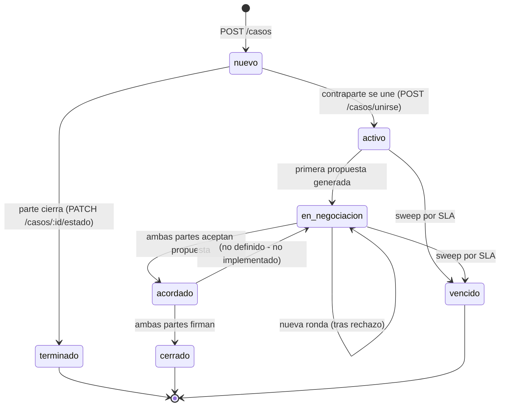
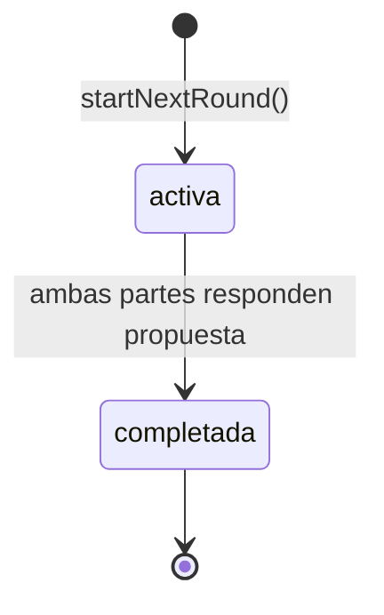
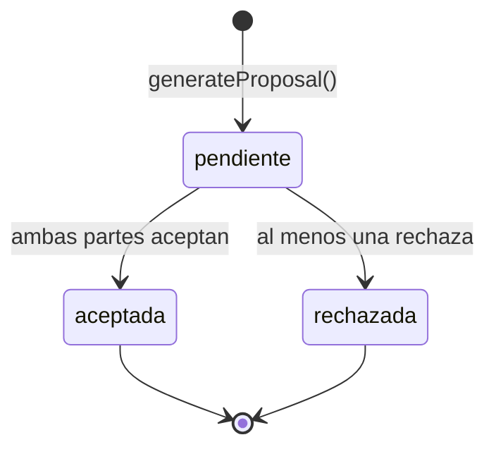
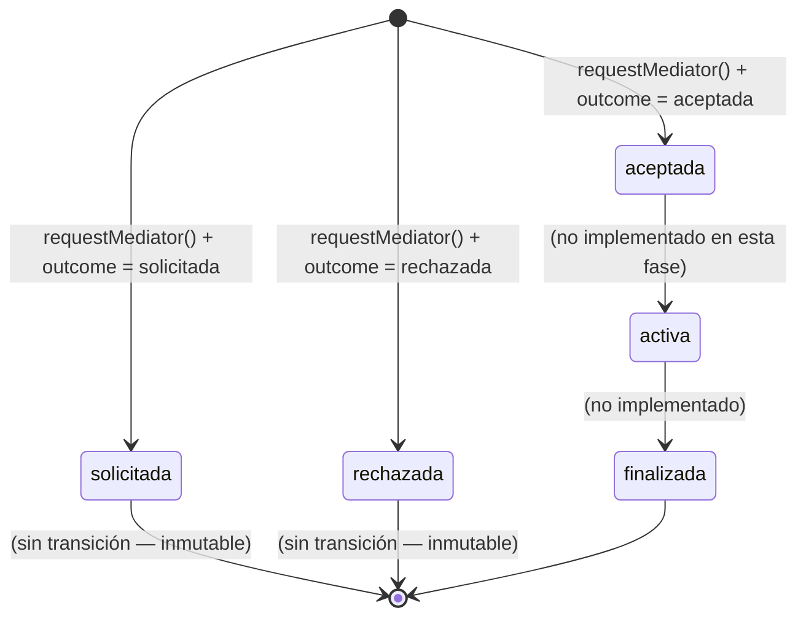
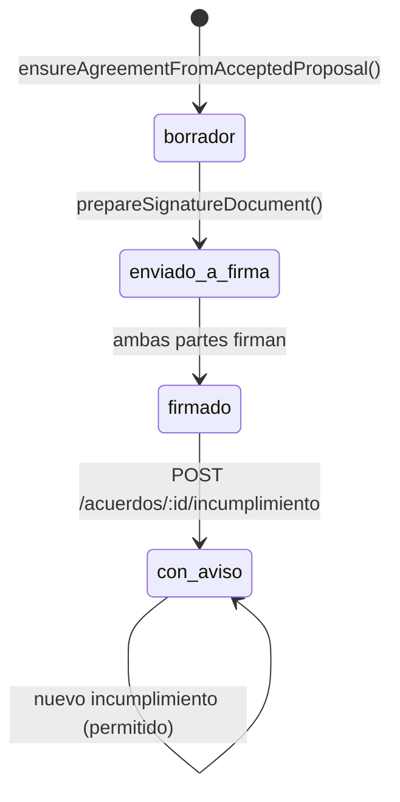
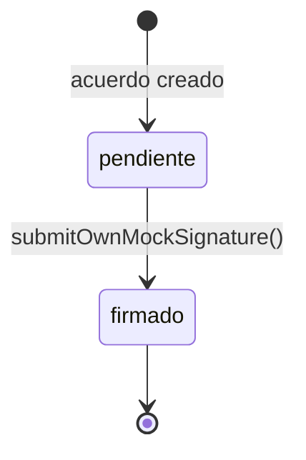
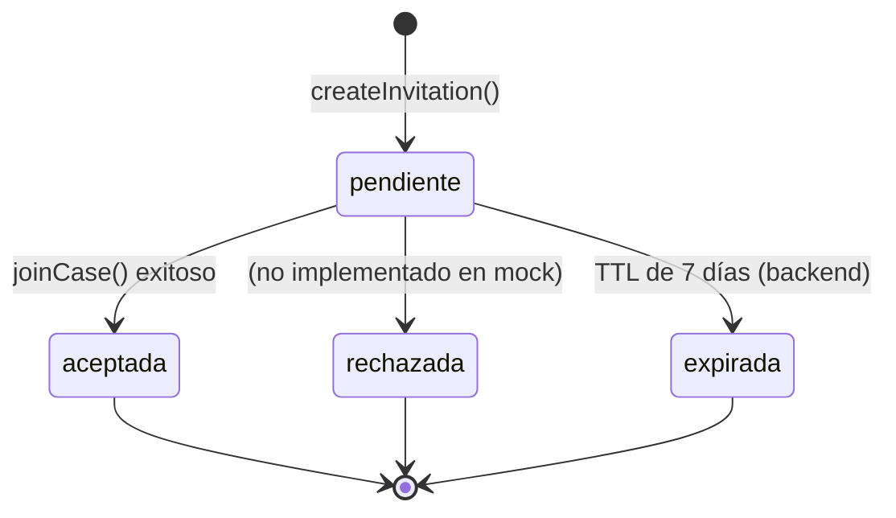
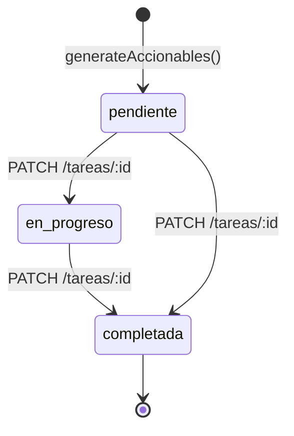

# Proyecto Mediación — Máquinas de estado

> Estados reales y documentados de las entidades del producto.
> El estado autoritativo SIEMPRE viene del backend. El frontend nunca inventa estados.

---

## Estado del Caso

**Estados:** `nuevo`, `activo`, `en_negociacion`, `acordado`, `cerrado`, `terminado`, `vencido`

**Transiciones validas (backend — trigger `validate_caso_estado_transition`):**
- `nuevo → activo` ✓
- `nuevo → terminado` ✓
- `activo → en_negociacion` ✓
- `en_negociacion → acordado` ✓
- `acordado → cerrado` ✓
- Cualquier estado activo → `vencido` (sweep)

**Fuente autoritativa:** Backend. `estado_caso` en tabla `casos`.

**Estados derivados del frontend (NUNCA persistidos):**
- `statusLabelKey`: `inReview`, `proposalReady`, `signed`, `awaitingCounterparty` (qué ve la parte AHORA)
- `visualStatus`: mapping de presentación (`success`, `warning`, `error`, `info`, `neutral`, `ai`)
- `CaseStatusLabelKey`: lo que la parte necesita saber a continuación, no un 1:1 del estado

**Rutas afectadas:** CaseDetailScreen, CasesDashboardScreen, NegotiationScreen

---

## Estado de la Ronda

**Estados:** `activa`, `completada`

**Transiciones:**
- `startNextRound()` → nueva ronda `activa`
- `submitOwnProposalResponse()` + simulated counterparty → ronda `completada`

**Reglas:**
- Solo una ronda `activa` por caso
- `mediatorAvailable = (number >= 3)`
- Se completa cuando la propuesta asociada recibe respuesta de AMBAS partes

**Actor que dispara:** Parte (startNextRound, submitResponse)

**Rutas afectadas:** NegotiationScreen (CurrentRoundCard, RoundHistoryCard)

---

## Estado de la Propuesta

**Estados:** `pendiente`, `aceptada`, `rechazada`

**Transiciones:**
- `generateProposal()` → `pendiente`
- Ambas `submitOwnProposalResponse('acepta')` → `aceptada`
- Al menos una `submitOwnProposalResponse('rechaza')` → `rechazada`

**Reglas de negocio:**
- Solo una propuesta por ronda activa
- La decisión de la contraparte simulada se aplica SOLO después de la respuesta propia
- `pendiente` con respuesta propia y sin contraparte → `waitingForOtherParty`

**Actor que dispara:** Parte (generateProposal), Parte (submitResponse)

**Rutas afectadas:** NegotiationScreen, SharedProposalCard, ProposalResponseActions

---

## Estado de la Mediación

**Estados:** `solicitada`, `aceptada`, `rechazada`, `activa`, `finalizada`

**Precondición:** `ronda >= 3`

**Reglas:**
- Una mediación por caso
- Sin cancelación (sin `cancelada` en el schema)
- Inmutable una vez creada
- Outcome determinístico: case-1 → aceptada, case-2 → solicitada, default → rechazada

**Eligibility (derivado):**
- `unavailable_before_round_3`: ronda < 3 o caso nuevo
- `available`: ronda >= 3, sin mediación previa
- `pending`: mediación `solicitada`
- `assigned`: mediación `aceptada` o `activa`
- `unavailable`: mediación `rechazada`
- `read_only`: caso acordado/terminal sin mediación

**Actor que dispara:** Parte (requestMediator)

**Rutas afectadas:** MediatorScreen, MediatorSummaryCard

---

## Estado del Acuerdo

**Estados:** `borrador`, `enviado_a_firma`, `firmado`, `con_aviso`

**Transiciones:**
- Materialización lazy → `borrador`
- `prepareSignatureDocument()` → `enviado_a_firma` (solo desde `borrador`)
- Ambas `submitOwnMockSignature()` → `firmado`
- `POST /acuerdos/:id/incumplimiento` → `con_aviso` (solo desde `firmado` o `con_aviso`)

**Estados derivados (frontend, NUNCA persistidos):**
- `canPrepareDocument`: `estado === 'borrador'`
- `canSign`: `estado === 'enviado_a_firma'` && propia firma pendiente && !readOnly
- `ownSignatureComplete`: propia firma === `'firmado'`
- `waitingForOtherParty`: `ownSignatureComplete` && !allSignaturesComplete
- `allSignaturesComplete`: `estado === 'firmado' || estado === 'con_aviso'` || todos firmado
- `readOnly`: `estado === 'firmado' || estado === 'con_aviso'`

**Regla de seguridad:** `allSignaturesComplete` se deriva del estado autoritativo del acuerdo. NO se infiere de contar firmas individuales si el acuerdo no está en estado `firmado`.

**Prioridad de `con_aviso`:** Un acuerdo con estado `con_aviso` debe conservar esa prioridad visual. El frontend lo trata como estado terminal (readOnly).

**Actor que dispara:** Parte (prepareDocument, submitSignature, reportBreach)

**Rutas afectadas:** AgreementScreen, SignScreen, AgreementHistoryScreen

---

## Estado de la Firma (Mock)

**Estados:** `pendiente`, `firmado`

**Nota:** `MockSignatureStatus` es un tipo de presentación frontend-only. NO es un enum del backend. `firmas.docusign_status` es free text del proveedor real que esta app nunca llama.

**Privacidad:**
- `SharedSignerStatus` solo expone `role` y `status`
- Sin `usuario_id`, email, ni identificadores
- `other_party` status se revela solo después de que la parte autenticada firma

**Actor que dispara:** Parte (submitSignature)

---

## Estado de la Invitación

**Estados:** `pendiente`, `aceptada`, `rechazada`, `expirada`

**Tipos:** `link`, `codigo`, `email`

**Actor que dispara:** Parte creadora (createInvitation), Contraparte (joinCase)

---

## Estado de la Tarea

**Estados:** `pendiente`, `en_progreso`, `completada`

**Generación:** Backend `tarea-generation.ts` deriva tareas del acuerdo firmado. Sin AI.

**Frontend:** Componentes de tareas existen pero NO integrados en pantallas de caso.

**Actor que dispara:** Sistema (genera), Parte (transiciona)

---

## Estados derivados peligrosos (NO hacer)

1. **NO derivar `allSignaturesComplete` de contar firmas `firmado` si el acuerdo no está en estado `firmado`.**
   - Fuente de verdad: `agreement.estado === 'firmado' || agreement.estado === 'con_aviso'`

2. **NO inferir que un pago está aprobado en el frontend.**
   - Fuente de verdad: webhook de MercadoPago → backend

3. **NO mostrar mediador antes de ronda 3.**
   - Gate: `utils/mediator-eligibility.ts` → `currentRoundNumber >= 3`

4. **NO mostrar posiciones de contraparte bajo ninguna circunstancia.**
   - RN-01: sin `getAllPositions`, sin `getCounterpartyPositions`

5. **NO derivar estado del caso de `statusLabelKey`.**
   - `statusLabelKey` es presentación. `estado` es la fuente de verdad.

6. **NO inventar estados de propuesta como "generando" o "en revisión".**
   - Son `MutationStatus` local (`idle|pending|error`), no estados persistentes.
