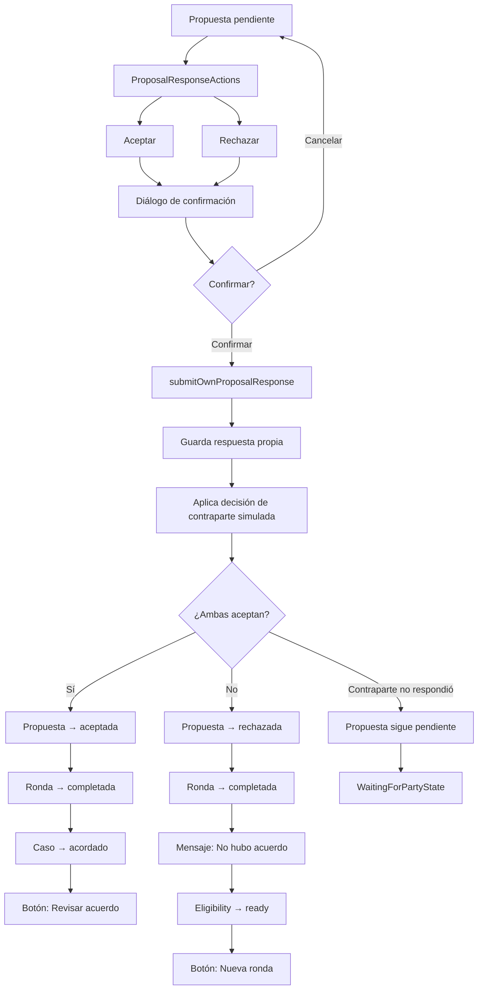
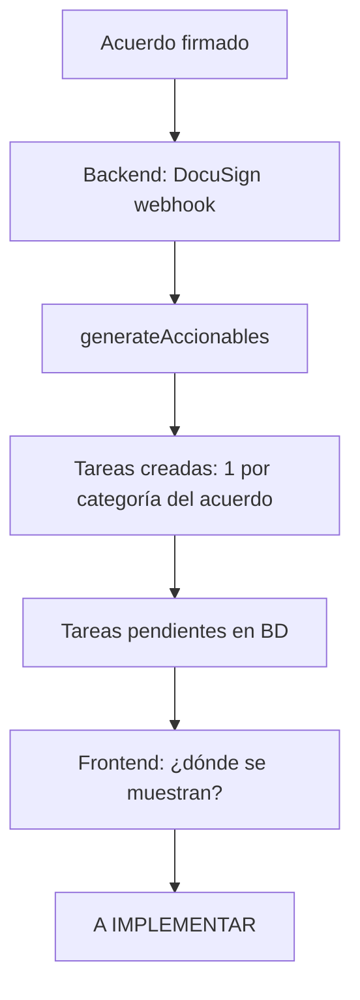

# Proyecto Mediación — Flujos de usuario

> Flujos reconstruidos del código real. Los diagramas representan el comportamiento verificado, no el documentado.

---

## Flujo 1: Registro e inicio de sesión

```mermaid
flowchart TD
    A[Abre app] --> B{¿Hay backend?}
    B -->|No| C[App usa mocks - sin auth]
    B -->|Sí| D[AuthGate verifica sesión]
    D --> E{¿Sesión activa?}
    E -->|Sí| F[Redirect a /]
    E -->|No| G[/login]
    G --> H[Ingresa email + password]
    H --> I[signIn con Supabase]
    I --> J{¿Éxito?}
    J -->|Sí| K[onSessionChange → signedIn]
    K --> F
    J -->|No| L[Error: credenciales inválidas]
    L --> H
    G --> M{¿No tiene cuenta?}
    M -->|Sí| N[/signup]
    N --> O[Ingresa nombre, apellido, email, password]
    O --> P[signUp con Supabase]
    P --> Q{¿Éxito?}
    Q -->|Sí + sesión| F
    Q -->|Sí sin sesión| R[Notice: confirmar email]
    Q -->|No| S[Error: email ya registrado]
    S --> O
```

**Actor:** Usuario nuevo o existente
**Punto de entrada:** Apertura de app
**Estado de implementación:** mock (sin backend configurado, AuthGate hace bypass)

---

## Flujo 2: Creación de caso

```mermaid
flowchart TD
    A[/ Dashboard] --> B[Click "Crear caso"]
    B --> C[Paso 1: Nombre y descripción]
    C --> D{Nombre válido?}
    D -->|No| C
    D -->|Sí| E[Paso 2: Elegir método]
    E --> F[Métodos: negociación, conciliación, mediación]
    F --> G[Paso 3: Revisar datos]
    G --> H[Confirmar creación]
    H --> I[POST /casos → caseId]
    I --> J[Paso 4: Invitar contraparte]
    J --> K[Tipo: link, código, email]
    K --> L[Generar invitación]
    L --> M[/case/create/success]
    M --> N[Ir al caso]
    N --> O[/case/:id]
    O --> P{Estado: nuevo}
    P --> Q[Vista "Esperando contraparte"]
```

**Actor:** Parte (creador)
**Punto de entrada:** Dashboard de casos → "Crear caso"
**Resultado:** Caso en estado `nuevo` con invitación generada
**Errores posibles:** Nombre vacío, fallo del mock createCase
**Estado de implementación:** mock (4 pasos, in-memory, sin backend)

---

## Flujo 3: Invitación y simulación de aceptación

```mermaid
flowchart TD
    A[/case/:id - estado nuevo] --> B[Ver invitación]
    B --> C[Link: copiar URL]
    B --> D[Código: copiar código]
    B --> E[Email: mostrar destinatario]
    A --> F["Simular aceptación"]
    F --> G[Diálogo de confirmación]
    G --> H[Confirmar]
    H --> I[casesService.simulateInvitationAcceptance]
    I --> J{Éxito?}
    J -->|Sí| K[estado: nuevo → activo]
    K --> L[Recargar pantalla]
    L --> M[Vista activa: posiciones + negociación]
    J -->|No| N[Error]
    N --> G
```

**Actor:** Parte (creador del caso)
**Punto de entrada:** CaseDetailScreen con `estado === 'nuevo'`
**Resultado:** `estado` cambia a `activo`. Se desbloquean posiciones y negociación.
**Nota:** Esta es una affordance de demo. En producción, la contraparte se une con `/case/join`.
**Estado de implementación:** mock

---

## Flujo 4: Unión a caso (contraparte)

```mermaid
flowchart TD
    A[Recibe invitación] --> B[/case/join]
    B --> C[Ingresa token]
    C --> D[joinCase con token]
    D --> E{¿Token válido?}
    E -->|Sí| F[Caso unido]
    F --> G[router.replace → /case/:id]
    E -->|No| H[Error: token inválido/expirado]
    H --> C
```

**Actor:** Contraparte (parte que se une)
**Punto de entrada:** `/case/join` (con token de invitación)
**Precondiciones:** Token generado por `createInvitation`, no expirado, no usado
**Resultado:** Usuario agregado como `parte_b`, caso activado (`nuevo → activo`)
**Estado de implementación:** mock (valida contra invitations en memoria)

---

## Flujo 5: Carga privada de posiciones

```mermaid
flowchart TD
    A[/case/:id - activo] --> B[Click "Cargar posiciones"]
    B --> C[/case/:id/positions]
    C --> D{¿Hay posiciones?}
    D -->|No| E[EmptyState + botón crear]
    D -->|Sí| F[Lista de posiciones propias]
    E --> G[/case/:id/positions/create]
    F --> G
    G --> H[Formulario: categoría, nombre, rango, cesión]
    H --> I{Validación OK?}
    I -->|No| H
    I -->|Sí| J[/case/:id/positions/review]
    J --> K[Revisar y confirmar]
    K --> L[positionsService.createOwnPosition]
    L --> M[Posición guardada]
    M --> F
    F --> N[Click en posición]
    N --> O[/positions/:positionId/edit]
    O --> P[Editar campos]
    P --> Q[positionsService.updateOwnPosition]
    Q --> F
    F --> R[Click eliminar]
    R --> S[Diálogo de confirmación]
    S --> T[positionsService.deleteOwnPosition]
    T --> F
```

**Actor:** Parte (cada parte gestiona solo sus posiciones)
**Punto de entrada:** CaseDetailScreen → "Cargar posiciones"
**Precondiciones:** `estado ∈ {activo, en_negociacion}`
**Privacidad crítica:** `ownerId === MOCK_OWNER_ID`. La contraparte nunca ve estas posiciones.
**Estados de la pantalla:** loading, lista, empty, ineligible (nuevo), read_only (acordado)
**Estado de implementación:** mock

---

## Flujo 6: Negociación — inicio de ronda y generación de propuesta

```mermaid
flowchart TD
    A[/case/:id/negotiation] --> B{Eligibility}
    B -->|waiting_counterparty| C[Esperando contraparte]
    B -->|positions_incomplete| D[Falta cargar posiciones]
    B -->|waiting_other_party| E[Esperando posiciones de contraparte]
    B -->|ready| F[Botón: Iniciar ronda]
    F --> G[startNextRound]
    G --> H[Nueva ronda activa]
    H --> I[Botón: Generar propuesta IA]
    I --> J[generateProposal]
    J --> K[AIProcessingState: generando...]
    K --> L[Propuesta pendiente]
    L --> M[Mostrar SharedProposalCard]
    B -->|in_progress| L
    B -->|read_only| N[Caso acordado/terminal]
```

**Actor:** Parte (cualquiera puede iniciar ronda y generar propuesta)
**Punto de entrada:** `/case/[id]/negotiation`
**Precondiciones:**
- `estado ∈ {activo, en_negociacion}`
- `ownPositionCount > 0`
- `counterpartyReady === true`
- No hay ronda activa con propuesta pendiente
- No hay propuesta aceptada previa
**Estados intermedios:** AIProcessingState mientras se genera
**Estado de implementación:** mock (1.5s delay simulado)

---

## Flujo 7: Respuesta a propuesta



**Actor:** Parte (cada una responde independientemente)
**Punto de entrada:** `/case/[id]/negotiation` con propuesta pendiente
**Decisión crítica:** La decisión de la contraparte simulada se revela SOLO después de que la parte autenticada envía su respuesta.
**Resultado:**
- Ambas aceptan: caso pasa a `acordado`, se materializa acuerdo
- Al menos una rechaza: ronda completada, se puede iniciar nueva ronda
- Contraparte no responde: estado `waitingForOtherParty`
**Estado de implementación:** mock (matriz determinística)

---

## Flujo 8: Mediador — disponibilidad desde ronda 3

```mermaid
flowchart TD
    A[Caso activo/en_negociacion] --> B{¿Ronda actual ≥ 3?}
    B -->|No| C[MediatorSummaryCard: no disponible]
    B -->|Sí| D[MediatorSummaryCard: disponible]
    D --> E[/case/:id/mediator]
    E --> F[Estado: available]
    F --> G[Botón: Solicitar mediador]
    G --> H[Diálogo de confirmación]
    H --> I{Confirmar?}
    I -->|Cancelar| E
    I -->|Confirmar| J[requestMediator]
    J --> K[resolveMediatorAssignment]
    K --> L{Outcome}
    L -->|case-1: aceptada| M[Mediador asignado]
    M --> N[SharedMediatorProfileCard: Lucía Fernández]
    L -->|case-2: solicitada| O[Solicitud pendiente]
    L -->|default: rechazada| P[No disponible]
```

**Actor:** Parte
**Punto de entrada:** `/case/[id]/mediator` o MediatorSummaryCard en CaseDetailScreen/NegotiationScreen
**Precondiciones:** `estado ∈ {activo, en_negociacion}` Y `ronda ≥ 3` Y sin mediación previa
**Restricción:** Solo `case-1 → aceptada` es alcanzable interactivamente con los seeds actuales.
**Estado de implementación:** mock

---

## Flujo 9: Acuerdo — de propuesta aceptada a firma

```mermaid
flowchart TD
    A[Propuesta aceptada por ambas partes] --> B[Materialización lazy del acuerdo]
    B --> C[ensureAgreementFromAcceptedProposal]
    C --> D[Acuerdo en estado: borrador]
    D --> E[/case/:id/agreement]
    E --> F[SharedAgreementCard + SignatureProgressCard]
    F --> G[Botón: Preparar documento]
    G --> H[prepareSignatureDocument]
    H --> I[AIProcessingState → DocumentPreparationState]
    I --> J[Acuerdo en estado: enviado_a_firma]
    J --> K[readyAt timestamp seteado]
    K --> L[Botón: Ir a firmar]
    L --> M[/case/:id/agreement/sign]
```

**Actor:** Parte (cualquiera puede preparar)
**Punto de entrada:** `/case/[id]/agreement` (accesible desde CaseDetailScreen cuando `estado === 'acordado'`)
**Precondiciones:** Propuesta aceptada existe en `negotiationService`
**Estado de implementación:** mock

---

## Flujo 10: Firma del acuerdo

```mermaid
flowchart TD
    A[/case/:id/agreement/sign] --> B[SharedAgreementCard: contenido del acuerdo]
    B --> C[SignatureEnvironmentNotice: Firma simulada]
    C --> D[MockSignatureConfirmation: checkbox]
    D --> E{¿Checkbox marcado?}
    E -->|No| F[Botón deshabilitado]
    E -->|Sí| G[Botón: Firmar]
    G --> H[submitOwnMockSignature]
    H --> I[Guarda firma propia]
    I --> J[Aplica firma de contraparte simulada]
    J --> K{¿Ambas firmaron?}
    K -->|Sí| L[Acuerdo → firmado]
    L --> M[completedAt timestamp]
    M --> N[allSignaturesComplete = true]
    N --> O[Mensaje: Proceso completado]
    K -->|No| P[waitingForOtherParty = true]
    P --> Q[Mensaje: Esperando contraparte]
```

**Actor:** Parte (cada una firma independientemente)
**Precondiciones:** `agreement.estado === 'enviado_a_firma'`
**Restricción legal:** La firma es MOCK. Aviso explícito de "entorno de prueba". Sin validez legal.
**Estado de implementación:** mock

---

## Flujo 11: Incumplimiento

```mermaid
flowchart TD
    A[/case/:id/agreement] --> B{¿estado ∈ {firmado, con_aviso}?}
    B -->|Sí| C[BreachNoticeForm visible]
    B -->|No| D[Formulario oculto]
    C --> E[Ingresar descripción del incumplimiento]
    E --> F[Click Enviar]
    F --> G{¿Descripción no vacía?}
    G -->|No| H[Error: campo requerido]
    G -->|Sí| I[Diálogo de confirmación]
    I --> J{¿Confirmar?}
    J -->|Cancelar| C
    J -->|Confirmar| K[Placeholder: cierra diálogo]
```

**Actor:** Parte
**Precondiciones:** `agreement.estado === 'firmado' || agreement.estado === 'con_aviso'`
**Estado de implementación:** parcial (formulario + diálogo funcionales, sin llamada real al backend)

---

## Flujo 12: Tareas post-acuerdo



**Actor:** Sistema (backend genera). Parte (frontend visualiza).
**Estado de implementación:** Backend implementado. Frontend tiene componentes (`TaskCard`, `TaskListSection`) pero NO integrados en ninguna pantalla. **Gap crítico para Stitch.**

---

## Flujo 13: Avisos y actividad

```mermaid
flowchart TD
    A[Tab Avisos /messages] --> B[NoticesOverviewHeader + NoticeFilterBar]
    B --> C[Lista de NoticeCard]
    C --> D{Tipo de notice}
    D -->|No leída + actionable| E[Tap → markNoticeRead → navegar a destino]
    D -->|Leída + actionable| F[Tap → navegar a destino]
    D -->|Informational (sin destino)| G[Botón: Marcar como leído]
    C --> H[MarkAllReadAction]
    A --> I[/notices/activity]
    I --> J[Línea de tiempo compartida]
    J --> K[ActivityTimelineItem × N]
```

**Actor:** Parte
**Punto de entrada:** Tab "Avisos" (`/messages`)
**Privacidad:** La actividad compartida NUNCA incluye eventos de posiciones privadas.
**Estado de implementación:** mock (12 notice fixtures + 21 activity fixtures)

---

## Flujo 14: Perfil y configuración

```mermaid
flowchart TD
    A[/profile] --> B[ProfileHeaderCard + ProfileMenuItem × 6]
    B --> C[Editar perfil]
    B --> D[Cuenta: sign-out, desactivación]
    B --> E[Notificaciones: 7 toggles]
    B --> F[Ayuda]
    B --> G[Legal]
    B --> H[Privacidad]
    D --> I[SignOutDialog]
    I --> J[signOutMock → router → /signed-out]
    J --> K[Pantalla signed-out]
    K --> L[Volver a la demo → restoreMockSession → /]
    D --> M[DeactivationDialog]
    M --> N[requestAccountDeactivationMock]
    N --> O{¿Ya solicitada?}
    O -->|Sí| P[already_requested — idempotente]
    O -->|No| Q[requested — timestamp guardado]
```

**Actor:** Parte
**Estado de implementación:** mock (datos de `mocks/profile.ts`)
**Nota:** `signOut` solo limpia flag de sesión mock. No borra datos de casos/posiciones.

---

## Diferencias código vs documentación

### Flujo de onboarding
- **Documentado:** `POST /auth/biometria`, `POST /auth/consentimiento`
- **Código frontend:** No hay pantallas de onboarding. El backend registra resultados pero el frontend no tiene UI para onboarding.
- **Impacto:** Stitch debe prever pantallas de consentimiento legal y verificación biométrica (si se confirma el proveedor).

### Flujo de planes/suscripciones
- **Documentado:** `GET /planes`, `POST /suscripciones`, MercadoPago webhook
- **Código frontend:** Sin referencias a planes o pagos.
- **Impacto:** Si aplica, debe diseñarse pantalla de selección de plan y gestión de suscripción.

### Flujo de estudio jurídico
- **Documentado:** Panel web para estudios jurídicos
- **Código frontend:** `apps/panel/` solo tiene package.json
- **Impacto:** Diseño pendiente. Stitch no necesita diseñarlo ahora pero debe saber que existe.
